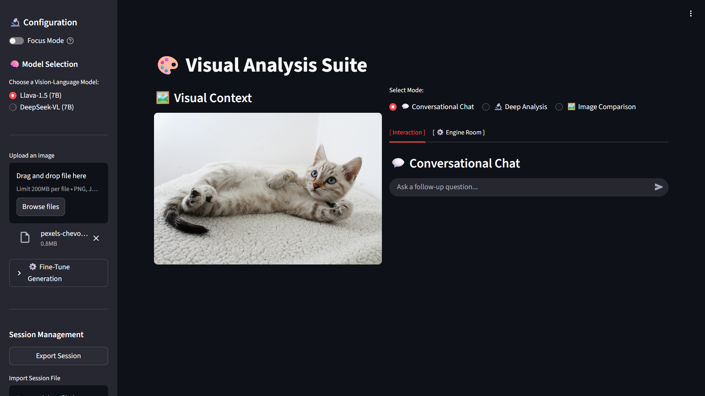
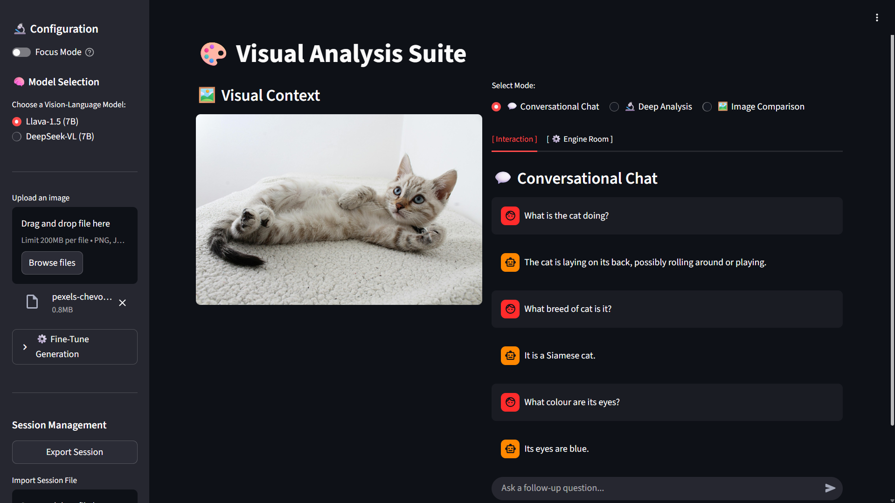
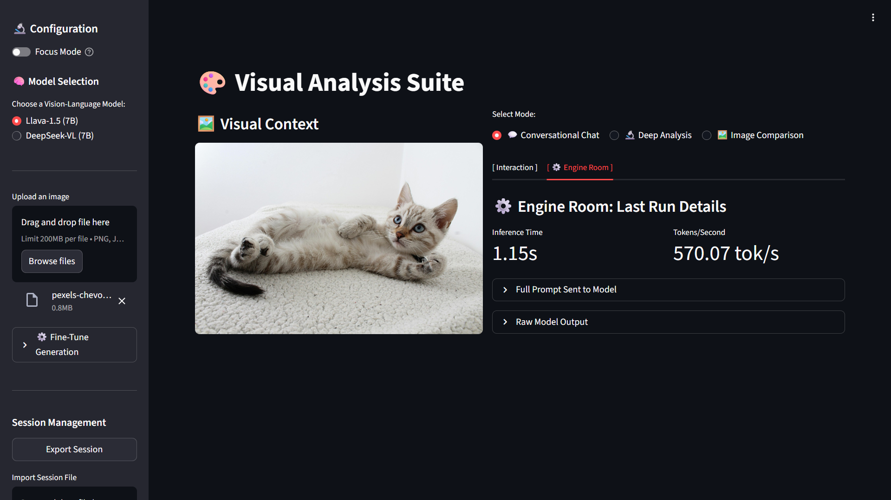
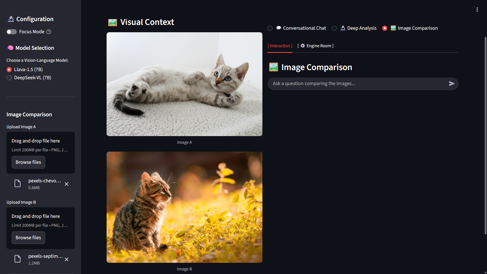
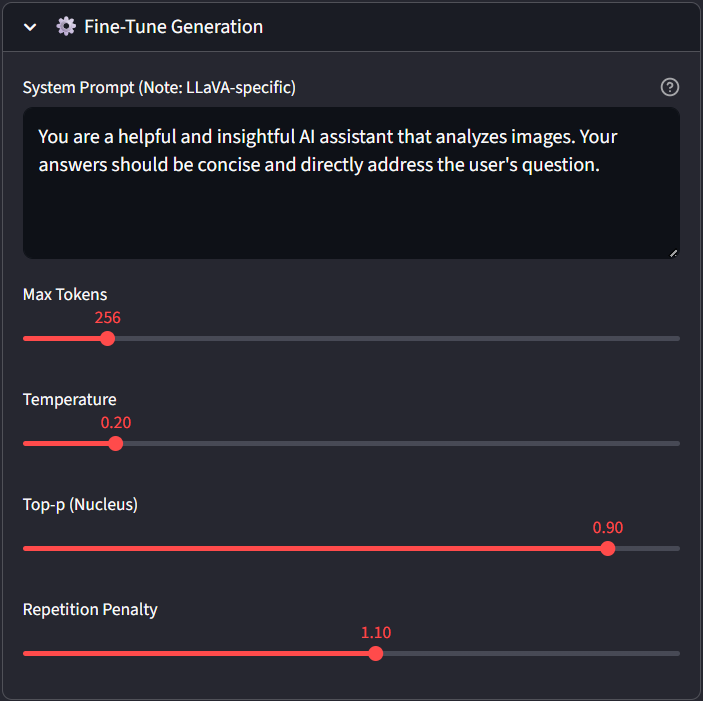
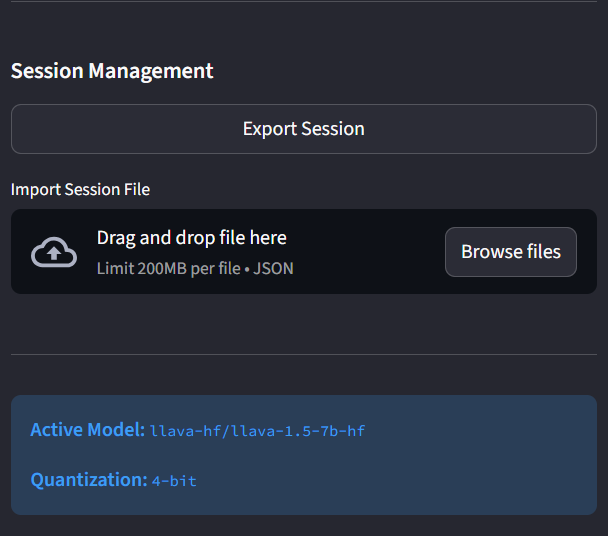
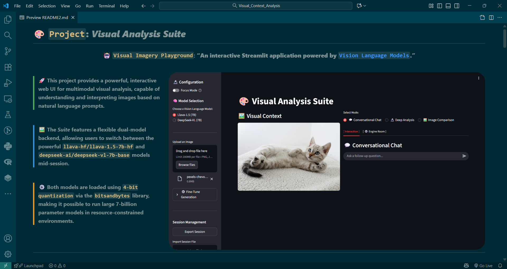

# 🎨 **`Project`: _Visual Analysis Suite_**
<div align="center">

### 🤖 `Visual Imagery Playground`: **“An interactive Streamlit application powered by [`Vision Language Models`](https://huggingface.co/blog/vlms).”** <br>

</div>

<br>


<div style="border-left: 4px solid #4CAF50; padding-left: 12px; margin: 12px 0; font-size: 16px;">
🚀 <b>This project provides a powerful, interactive web UI for multimodal visual analysis, capable of understanding and interpreting images based on natural language prompts.</b>
</div>

<br>

<div style="border-left: 4px solid #2196F3; padding-left: 12px; margin: 12px 0; font-size: 16px;">
🖼️ <b>The <i>Suite</i> features a flexible dual-model backend, allowing users to switch between the powerful <code>llava-hf/llava-1.5-7b-hf</code> and <code>deepseek-ai/deepseek-vl-7b-base</code> models mid-session.</b>
</div>

<br>

<div style="border-left: 4px solid #FF9800; padding-left: 12px; margin: 12px 0; font-size: 16px;">
⚙️ <b>Both models are loaded using <code>4-bit quantization</code> via the <code>bitsandbytes</code> library, making it possible to run large 7-billion parameter models in resource-constrained environments.</b>
</div>

<div style="clear: both;"></div>

---

<br>

<div align="left">

# 🗂️ Project Structure

<br>

</div>

```markdown-tree
📁 visual_analysis_suite/
├── app.py                         # Application entry point (runs the Streamlit app)
├── config.py                      # Central configuration for models and page settings
├── requirements.txt               
└── README.md                      
|
├── 📁 core/                        
│   ├── model_loader.py            # Handles dynamic loading and caching of models
│   └── inference.py               # Runs model-specific inference and performance tracking
│
├── 📁 ui/                         
│   ├── sidebar.py                 # Renders the sidebar for controls and settings
│   └── views.py                   # Renders the main interaction tabs and views
│
├── 📁 utils/                      
│   ├── session.py                 # Manages session state import/export
│   ├── helpers.py                 # Contains helper functions 
│   └── prompting.py               # Logic for creating model-specific prompts
│
├── 📁 data/                        
│   └── visual_suite_session.json  # An exported session file
│
└── 📁 assets/                     
```

<br>

<div align="left">

# ⚙️ **Features & Parameters**

</div>

---

<div align="left"; style="display: flex; align-items: flex-start; justify-content: space-between; gap: 30px; flex-wrap: wrap;">

  <!-- LEFT SIDE -->
  <div style="flex: 1; min-width: 320px;">

  <h3>🤖 <b>Model & Generation Parameters</b></h3>

  <ul>
    <li><b>Model Selection</b> — Instantly switch between <code>Llava-1.5</code> and <code>DeepSeek-VL</code> in the sidebar.</li>
    <li><b>System Prompt</b> — Customize the base instructions given to the model to alter its persona and response style.</li>
    <li><b>Max New Tokens</b> — Control the maximum length of the generated response.</li>
    <li><b>Temperature</b> — Adjust the randomness of the output; lower values are more deterministic, higher are more creative.</li>
    <li><b>Top-p (Nucleus Sampling)</b> — Controls the diversity of the vocabulary used in the response.</li>
    <li><b>Repetition Penalty</b> — Penalizes the model for repeating words or phrases, encouraging more varied output.</li>
  </ul>

  <h3>🎨 <b>Interaction Modes</b></h3>

  <ul>
    <li><b>Conversational Chat</b> — Engage in a dynamic, multi-turn conversation about a single image.</li>
    <li><b>Deep Analysis</b> — Use a toolkit of pre-defined prompts for specific tasks like object detection, scene description, or creative writing.</li>
    <li><b>Image Comparison</b> — Upload two images side-by-side and ask comparative questions.</li>
    <li><b>Session Management</b> — Export and import your entire session, including images and chat history, to a <code>JSON</code> file.</li>
  </ul>

</div>
</div>

---

<div style="text-align: center;">

### 🔬 **Performance & Diagnostics**

The **Engine Room** tab provides a look "under the hood" at the last model inference run.

| Metric | Description | Location |
|:---|:---|:---|
| `Inference Time` | The total wall-clock time taken for the model to generate a response. | `Engine Room` |
| `Tokens/Second` | The speed of token generation, a key measure of performance. | `Engine Room` |
| `Full Prompt` | The exact, formatted prompt string sent to the model for analysis. | `Engine Room` |
| `Raw Model Output` | The complete, unparsed output from the model before formatting. | `Engine Room` |

</div>

---

<br>

---

<div align="left">

# 🚀 Getting Started

</div>

---

### **📋 1. Prerequisites**

Before you begin, ensure you have the following essential tools installed on your system.

*   **Python 3.11+**: The core programming language.
*   **Git**: For cloning the repository.
*   `pip` and `venv`: Standard Python package and environment managers.
*   **(Recommended)** An NVIDIA GPU with CUDA installed to leverage 4-bit quantization.

---

### **⚙️ 2. Installation & Setup**

This step-by-step guide will set up the entire project environment. Open your terminal or command prompt and execute the following commands.

**1. Clone the Repository**  

First, clone this repository to your local machine.

```bash
git clone https://github.com/Sairaj213/Visual_Analysis_Suite.git
```

**2. Navigate to the Project Directory**  

Change into the newly created folder.

```bash
cd visual_analysis_suite
```

**3. Create and Activate a Virtual Environment**  

This isolates the project's dependencies from your system-wide Python installation.

*   **On Windows:**
    ```bash
    python -m venv venv
    venv\Scripts\activate
    ```
*   **On macOS / Linux:**
    ```bash
    python3 -m venv venv
    source venv/bin/activate 
    ```
    (Your terminal prompt should now be prefixed with `(venv)`)

**4. Install Required Dependencies**  

⚠️ Please!!, Install `torch` and `packaging, setuptools, wheel, ninja` package before installing [`requirements.txt`]().


```bash
pip install torch
```

```bash
pip install packaging setuptools wheel ninja
```

This command reads the `requirements.txt` file and installs all necessary libraries into your virtual environment.

```bash
pip install -r requirements.txt
```

---

### **🛰️ 3. Launch the Application!**

With the setup complete, you are now ready to launch the Visual Analysis Suite.

```bash
streamlit run app.py
```

Your default web browser will automatically open a new tab with the application running. The first time you select a model, it will be downloaded and cached, which may take a few minutes.

# 📷 Sample Images
<div align="center">





 
   

</div>


<div style="clear: both;"></div>

<br>

---



The `README.md` looks way better in `Visual Studio Code`


